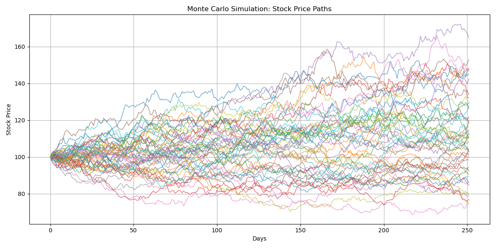

# Monte Carlo Simulation: Stock Price Paths

This project uses a Monte Carlo method to simulate future stock price paths using **Geometric Brownian Motion (GBM)**.  
It's a foundational technique in quantitative finance used for pricing, forecasting, and risk analysis.

---

## 🧠 Key Learnings

- How to model stock prices using stochastic processes
- Use of random number generation to simulate uncertainty
- Understanding the importance of drift and volatility in price evolution
- Visualising future outcomes and uncertainty bands

---

## 📈 Output

The plot below shows the results of a Monte Carlo simulation of 1,000 potential stock price paths over a one-year horizon (252 trading days), starting from an initial price of $100.



Each line represents one possible future path of the stock, based on a Geometric Brownian Motion (GBM) process. This model assumes:

- A constant expected return (`μ`)
- A constant volatility (`σ`)
- Random shocks generated from a standard normal distribution

---

### 🔍 Interpretation

- The lines **fan out** over time, showing increasing uncertainty the further into the future you go.
- Some paths end significantly above the initial price, while others dip far below — demonstrating the **range of possible outcomes** in a probabilistic market.
- This visualisation is useful in:
  - **Option pricing** (e.g., Monte Carlo for path-dependent options)
  - **Risk modelling** (e.g., estimating the likelihood of extreme drops)
  - **Scenario analysis** (e.g., stress testing)

At the end of the notebook, we calculate the **expected final price** and the **standard deviation** across all simulated outcomes, giving a quick snapshot of potential risk and reward.

---

## 🛠️ Tools Used

- Python
- NumPy
- Matplotlib

---

## ▶️ How to Run

1. Clone the repository or download the ZIP
2. Open the `.ipynb` file in Jupyter Notebook or VS Code
3. Run all cells to see simulation and outputs

Install required library (if needed):

```bash
pip install numpy matplotlib